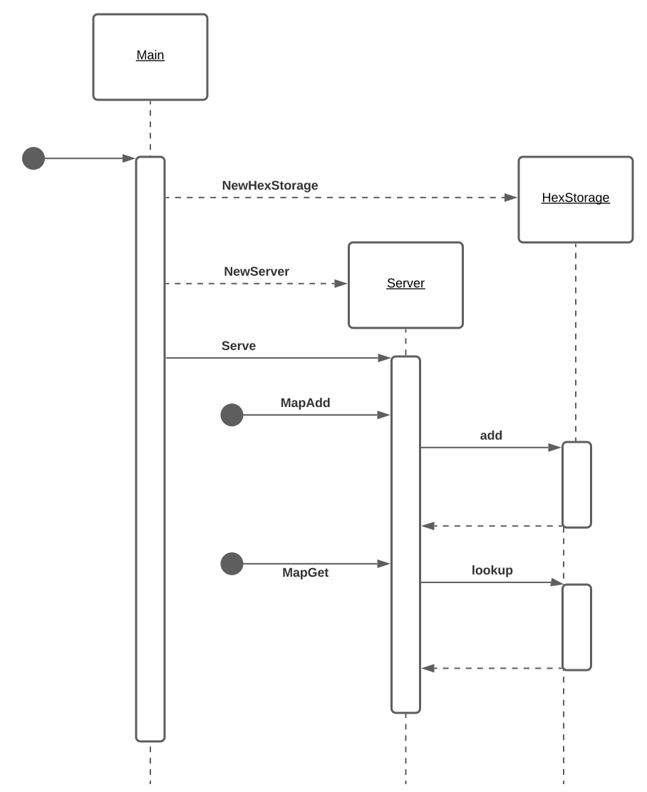

Backend server and main access point via gRPC API for the game.

## Run
### Help
```shell
go run .\cmd\hexcloud\hexcloud.go -h 
or 
hexcloud -h 

Usage of hexcloud:
  -address string
        address and port number to listen on (default "0.0.0.0:8080")
  -local
        running local
```
### Start server
Start the server listening on `localhost:8080`
```shell
go run .\cmd\hexcloud\hexcloud.go  
or 
hexcloud 
```

## Docker
```bash
docker build -f ./deploy/hexcloud/Dockerfile -t hexcloud .
```

## Update gRPC proto
```shell
go install google.golang.org/protobuf/cmd/protoc-gen-go
install google.golang.org/grpc/cmd/protoc-gen-go-grpc
protoc --go_out=./internal/pkg  --go-grpc_out=./internal/pkg ./api/hexagon.proto
```

## Program Flow
Program flow of two of the [API calls](./api/hexagon.proto) (MapAdd and MapGet)


